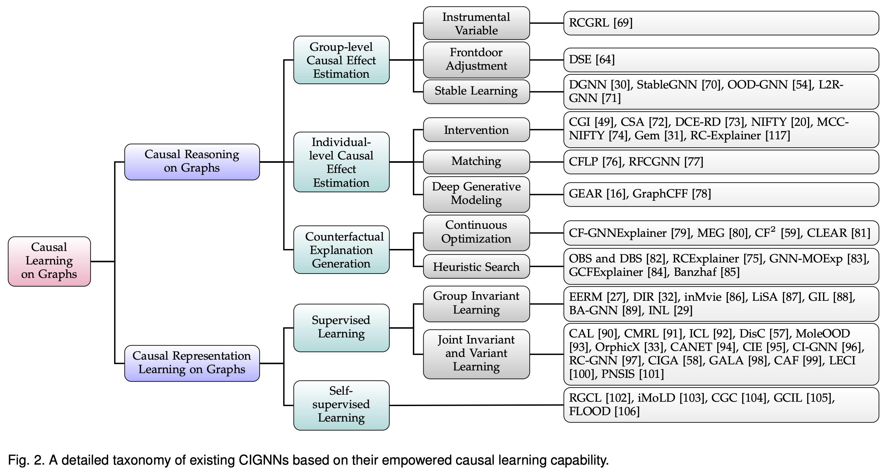

# Awesome-Causality-Inspired-GNNs

<p align="center">
 
[](https://awesome.re)


</p>


This repository curated list of awesome Causality-Inspired Graph Neural Network (CIGNN) works and relevant resources reviewed in our survey 'When Graph Neural Network Meets Causality: Opportunities, Methodologies and An Outlook'. Recently, the integration of causal learning techniques into GNNs has demonstrated significant potential in mitigating trustworthiness issues. This is achieved by capturing the underlying data causality instead of relying on superficial correlations. In this survey, we comprehensively reviews the recent progress of CIGNNs within a novel taxonomy, aiming to distill the fundamental rationales behind these works in the lens of causality and spark further research on this promising direction. A preprint version can be found at [Link](http://arxiv.org/abs/2312.12477).




## Outlines
 - [Benchmark Datasets](#benchmark-datasets) 
    - [OOD](#ood)
    - [Fairness](#fairness)
    - [Explainability](#explainability)
 - [Code and Packages](#code-and-packages)
    - [CIGNN Related](#cignn-related)
    - [Causal Learning](#causal-learning)

- [CIGNN Works](#cignns-works)
  - [Causal Reasoning on Graphs](#causal-reasoning-on-graphs)
    - [Group-level Causal Effect Estimation](#group-level-causal-effect-estimation)
      - [Instrumental Variable](#instrumental-variable)
      - [Frontdoor Adjustment](#frontdoor-adjustment)
      - [Stable Learning](#stable-learning)
    - [Individual-level Causal Effect Estimation](#individual-level-causal-effect-estimation)
      - [Intervention](#intervention)
      - [Matching](#matching)
      - [Deep Generative Modeling](#deep-generative-modeling)
    - [Graph Counterfactual Generation](#graph-counterfactual-generation)
      - [Continuous Optimization](#continuous-optimization)
      - [Heuristic Search](#heuristic-search)
  - [Causal Representation Learning on Graphs](#causal-representation-learning-on-graphs)
    - [Supervised Learning](#supervised-learning)
      - [Group Invariant Learning](#group-invariant-learning)
      - [Joint Invariant and Variant Learning](#joint-invariant-and-variant-learning)
    - [Self-supervised Learning](#self-supervised-learning)
  - [Causal Discovery on Graphs](#causal-discovery-on-graphs)


## Benchmark Datasets

### OOD
- (*Arxiv 2202.07987*) H. Li, et al., “Out-of-distribution generalization on graphs: A survey,” CoRR, vol. abs/2202.07987, 2022. [[Paper]](https://arxiv.org/pdf/2202.07987)

- (*NIPS'22*) GOOD: A graph out-of-distribution benchmark, [[Paper]](https://proceedings.neurips.cc/[Paper]_files/[Paper]/2022/file/0dc91de822b71c66a7f54fa121d8cbb9-[Paper]-Datasets_and_Benchmarks.pdf), [[Github]](https://[Github].com/divelab/GOOD/)

- (*Arxiv 2201.09637*) Drugood: Out-of-distribution (OOD) dataset curator and benchmark for ai-aided drug discovery - A focus on affinity prediction problems with noise annotations. [[Paper]](https://arxiv.org/pdf/2201.09637), [[Github]](https://[Github].com/tencent-ailab/DrugOOD)

- (*Arxiv 2310.03152*) Towards out-of-distribution generalizable predictions of chemical kinetics properties. [[Paper]](https://arxiv.org/pdf/2310.03152), [[Github]](https://[Github].com/zihao-wang/ReactionOOD)

### Fairness
- (*Arxiv 2204.09888*) Fairness in graph mining: A survey. [[Paper]](https://ieeexplore.ieee.org/iel7/69/4358933/10097603.pdf), [[Github]](https://[Github].com/yushundong/Graph-Mining-Fairness-Data)

### Explainability
- (*TPAMI'23*) Explainability in graph neural networks: A taxonomic survey. [[Paper]](https://ieeexplore.ieee.org/iel7/34/4359286/09875989.pdf)

- (*CSUR'23*) A survey on graph counterfactual explanations: Definitions, methods, evaluation, and research challenges. [[Paper]](https://dl.acm.org/doi/pdf/10.1145/3618105)


## Code and Packages

### CIGNNs
- (*NIPS'22*) GOOD: A graph out-of-distribution benchmark, [[Paper]](https://proceedings.neurips.cc/[Paper]_files/[Paper]/2022/file/0dc91de822b71c66a7f54fa121d8cbb9-[Paper]-Datasets_and_Benchmarks.pdf), [[Github]](https://[Github].com/divelab/GOOD/)

- (*CIKM'22*) GRETEL: graph counterfactual explanation evaluation framework. [[Paper]](https://dl.acm.org/doi/pdf/10.1145/3511808.3557608), [[Github]](https://[Github].com/MarioTheOne/GRETEL)

- (*WSDM'23*) Developing and evaluating graph counterfactual explanation with GRETEL. [[Paper]](https://dl.acm.org/doi/pdf/10.1145/3539597.3573026), [[Github]](https://[Github].com/MarioTheOne/GRETEL)

### Causal Learning
- (*CIKM'21*) Causebox: A causal inference toolbox for benchmarking treatment effect estimators with machine learning methods. [[Paper]](https://dl.acm.org/doi/pdf/10.1145/3459637.3481974), [[Github]](https://[Github].com/paras2612/CauseBox)
- (*Arxiv 2307.16405*) Causal-learn: Causal discovery in python. [[Paper]](https://arxiv.org/pdf/2307.16405), [[Github]](https://[Github].com/py-why/causal-learn)
- (*ICLR'23*) 3DIdentBox: A Toolbox for Identifiability Benchmarking. [[Paper]](https://www.cclear.cc/2023/AcceptedDatasets/bizeul23a.pdf), [[Github]](https://[Github].com/alicebizeul/3DIdentBox)


## CIGNN Works

### Causal Reasoning on Graphs

#### Group-level Causal Effect Estimation

##### Frontdoor Adjustment
- (*Arxiv 2201.08802*) Deconfounding to explanation evaluation in graph neural networks.

##### Instrumental Variable
- (*AAAI'23*) Robust causal graph representation learning against confounding effects.

##### Stable Learning
- (*TNNLS'22*) Debiased graph neural networks with agnostic label selection bias.
- (*TPAMI'23*) Generalizing graph neural networks on out-of-distribution graphs. [[Github]](https://github.com/googlebaba/StableGNN)
- (*TKDE'23*) OOD-GNN: out-of-distribution generalized graph neural network.
- (*AAAI'24*) Learning to reweight for generalizable graph neural network


#### Individual-level Causal Effect Estimation

##### Intervention
- (*SIGIR'21*) Should graph convolution trust neighbors? A simple causal inference method.
- (*IJCAI'23*) Causal based supervision of attention in graph neural network: A better and simpler choice towards powerful attention.
- (*KDD'23*) Rumor detection with diverse counterfactual evidence.
- (*UAI'21*) Towards a unified framework for fair and stable graph representation learning.
- (*ICDM'21*) A multi-view confidence calibrated framework for fair and stable graph representation learning.
- (*ICML'21*) Generative causal explanations for graph neural networks.
- (*TPAMI'23*) Reinforced causal explainer for graph neural networks.

##### Matching
- (*ICML'22*) Learning from counterfactual links for link prediction.
- (*ICDM'23*) Mitigating multisource biases in graph neural networks via real counterfactual samples.

##### Deep Generative Modeling
- (*WSDM'22*) Learning fair node representations with graph counterfactual fairness.
- (*2023*) Counterfactual fairness on graphs: Augmentations, hidden confounders, and identifiability.

#### Graph Counterfactual Generation

##### Continuous Optimization

##### Heuristic Search

- (*NIPS'21*) Robust counterfactual explanations on graph neural networks.

### Causal Discovery on Graphs
Coming soon.

### Causal Representation Learning on Graphs
Coming soon.

<!-- Repeat the above format for each relevant work -->

## Contributing

We appreciate your kind contributions and suggestions! If you know of any causality-inspired GNN works that are not listed, feel free to [open an issue](https://[Github].com/usail-hkust/Causality-Inspired-GNNs/issues). We will update them in our survey and repository.

## License

This project is licensed under the MIT License.

## References

If you find our work useful for your research, please consider citing

```bibtex
@article{jiang2023survey,
  title={Survey on Trustworthy Graph Neural Networks: From A Causal Perspective},
  author={Jiang, Wenzhao and Liu, Hao and Xiong, Hui},
  journal={arXiv preprint arXiv:2312.12477},
  year={2023}
}
```
